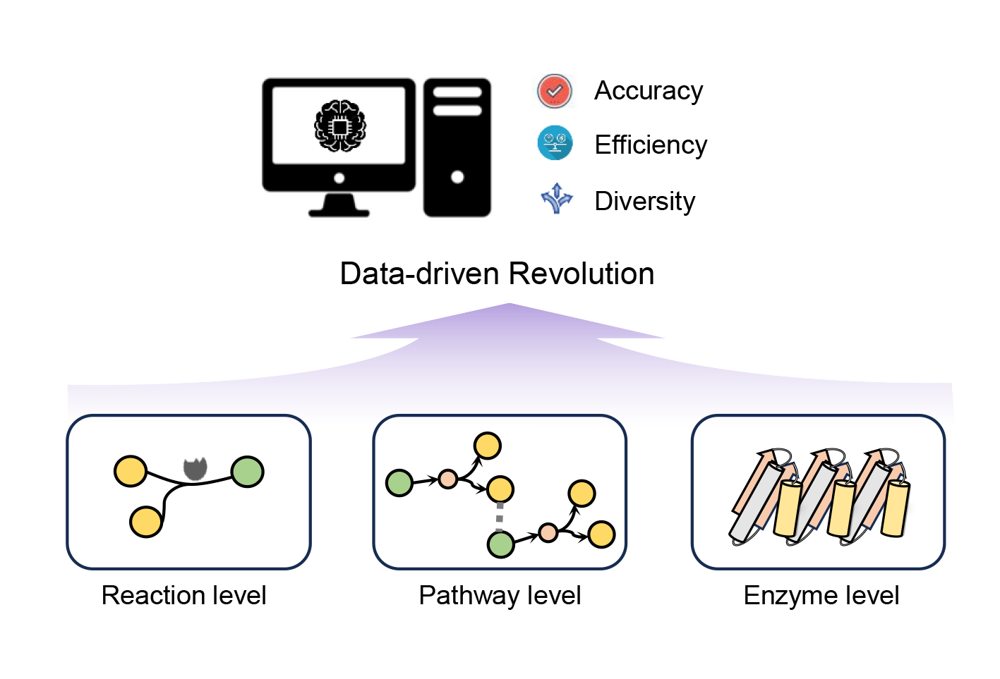

🔍 This is a repository for Data-Driven methods of Enzyme Catalysis.
---

<p align="center">
  
<p align="center">
  <em>Toc-Graph</em>
</p>

  


🔗 Link directly to [Figures](https://github.com/Tiantao2000/Data-driven-enzyme-catalysis/tree/main/Figures#figures), [Tables](https://github.com/Tiantao2000/Data-driven-enzyme-catalysis/tree/main/Tables#tables)

---

✅ __What sets us apart from similar resources:__

1. Versatile Tags: Important papers that are Well Organized.
2. Effortless Navigation: Internal links facilitate quick transitions between sections and papers.
3. Tools collection: Potential tools for enzymatic catalysis are well collected.


## 🪜 _ representative tools (only provide Websever):

1. For Function annatation of Enzymes:
  
2. For structure prediction of Enzymes

3. For bio-retrosynthesis (or forward synthesis)

4. Others


## 📅 Important Papers last ten month, updated on 2024-12-15:

[1] Wang, X., Quinn, D., Moody, T. S., et al. (2024). [ALDELE: All-purpose deep learning toolkits for predicting the biocatalytic activities of enzymes](https://pubs.acs.org/doi/full/10.1021/acs.jcim.4c00058). *Journal of Chemical Information and Modeling*, 64(8), 3123-3139.

[2] Hua, C., Liu, Y., Zhang, D., et al. (2024). [Enzymeflow: Generating reaction-specific enzyme catalytic pockets through flow matching and co-evolutionary dynamics](https://arxiv.org/abs/2410.00327). *arXiv preprint arXiv:2410.00327*.

[3] Song, Z., Zhao, Y., Shi, W., et al. (2024). [Generative Enzyme Design Guided by Functionally Important Sites and Small-Molecule Substrates](https://arxiv.org/abs/2405.08205). *arXiv preprint arXiv:2405.08205*.

[4] Hua, C., Zhong, B., Luan, S., et al. (2024). [Reactzyme: A benchmark for enzyme-reaction prediction](https://arxiv.org/abs/2408.13659). *arXiv preprint arXiv:2408.13659*.


---
## 📅 Papers in our review
### 1. Overall Review
[1] Sheldon, R.A., & Woodley, J.M. (2018). [Role of biocatalysis in sustainable chemistry](https://pubs.acs.org/doi/10.1021/acscentsci.0c01496). *Chemical Reviews*, 118, 801-838.

[2] Winkler, C.K., Schrittwieser, J.H., & Kroutil, W. (2021). [Power of biocatalysis for organic synthesis](https://pubs.acs.org/doi/10.1021/acscentsci.0c01496). *ACS Central Science*, 7, 55-71.

[3] Hadadi, N., & Hatzimanikatis, V. (2015). [Design of computational retrobiosynthesis tools for the design of de novo synthetic pathways](https://www.sciencedirect.com/science/article/pii/S1367593115000769). *Current Opinion in Chemical Biology*, 28, 99-104.

[4] Lin, G.-M., Warden-Rothman, R., & Voigt, C.A. (2019). [Retrosynthetic design of metabolic pathways to chemicals not found in nature](https://www.sciencedirect.com/science/article/pii/S2452310019300368). *Current Opinion in Systems Biology*, 14, 82-107.

[5] Ming, Y., Wang, W., Yin, R., Zeng, M., Tang, L., Tang, S., & Li, M. (2023). [A review of enzyme design in catalytic stability by artificial intelligence](https://academic.oup.com/bib/article/24/3/bbad065/7086816). *Briefings in Bioinformatics*, 24, bbad065.

### 2.	Data and databases for modeling enzyme catalysis

[1] Chang, A., Jeske, L., Ulbrich, S., Hofmann, J., Koblitz, J., Schomburg, I., Neumann-Schaal, M., Jahn, D., & Schomburg, D. (2021). [BRENDA, the ELIXIR core data resource in 2021: new developments and updates](https://academic.oup.com/nar/article/49/D1/D498/5992283). *Nucleic Acids Research*, 49, D498-D508.

[2] Kanehisa, M., Furumichi, M., Sato, Y., Kawashima, M., & Ishiguro-Watanabe, M. (2023). [KEGG for taxonomy-based analysis of pathways and genomes](https://academic.oup.com/nar/article/51/D1/D587/6775388). *Nucleic Acids Research*, 51, D587-D592.

[3] Caspi, R., Billington, R., Keseler, I.M., Kothari, A., Krummenacker, M., Midford, P.E., Ong, W.K., Paley, S., Subhraveti, P., & Karp, P.D. (2020). [The MetaCyc database of metabolic pathways and enzymes—a 2019 update](https://academic.oup.com/nar/article/48/D1/D445/5581728). *Nucleic Acids Research*, 48, D445-D453.

[4] Bansal, P., Morgat, A., Axelsen, K.B., Muthukrishnan, V., Coudert, E., Aimo, L., Hyka-Nouspikel, N., Gasteiger, E., Kerhornou, A., & Neto, T.B. (2022). [Rhea, the reaction knowledgebase in 2022](https://academic.oup.com/nar/article/50/D1/D693/6424769). *Nucleic Acids Research*, 50, D693-D700.

[5] Milacic, M., Beavers, D., Conley, P., Gong, C., Gillespie, M., Griss, J., Haw, R., Jassal, B., Matthews, L., & May, B. (2024). [The Reactome pathway knowledgebase 2024](https://academic.oup.com/nar/article/52/D1/D672/7369850). *Nucleic Acids Research*, 52, D672-D678.

### 3. Reaction-level modeling for enzyme catalysis
Finnigan, W., Hepworth, L.J., Flitsch, S.L., & Turner, N.J. (2021). [RetroBioCat as a computer-aided synthesis planning tool for biocatalytic reactions and cascades](https://www.nature.com/articles/s41929-020-00556-z). *Nature Catalysis*, 4, 98-104.

[2] Sankaranarayanan, K., Heid, E., Coley, C.W., Verma, D., Green, W.H., & Jensen, K.F. (2022). [Similarity based enzymatic retrosynthesis](https://pubs.rsc.org/en/content/articlehtml/2022/sc/d2sc01588a). *Chemical Science*, 13, 6039-6053.

[3] Kreutter, D., Schwaller, P., & Reymond, J.-L. (2021). [Predicting enzymatic reactions with a molecular transformer](https://pubs.acs.org/doi/10.1021/acscentsci.0c01496). *Chemical Science*, 12, 8648-8659.

[4] Qian, W., Wang, X., Kang, Y., Pan, P., Hou, T., & Hsieh, C.-Y. (2024). [A general model for predicting enzyme functions based on enzymatic reactions](https://link.springer.com/article/10.1186/s13321-024-00827-y). *Journal of Cheminformatics*, 16, 38.

[5] Probst, D., Manica, M., Nana Teukam, Y.G., Castrogiovanni, A., Paratore, F., & Laino, T. (2022). [Biocatalysed synthesis planning using data-driven learning](https://www.nature.com/articles/s41467-022-28536-w). *Nature Communications*, 13, 964.

### 4. Pathway-level modeling for enzyme catalysis
[1] Motwalli, O., Uludag, M., Mijakovic, I., Alazmi, M., Bajic, V.B., Gojobori, T., Gao, X., & Essack, M. (2020). [PATHcre8: a tool that facilitates the searching for heterologous biosynthetic routes](https://pubs.acs.org/doi/abs/10.1021/acssynbio.0c00058). *ACS Synthetic Biology*, 9, 3217-3227.

[2] Hafner, J., MohammadiPeyhani, H., Sveshnikova, A., Scheidegger, A., & Hatzimanikatis, V. (2020). [Updated ATLAS of biochemistry with new metabolites and improved enzyme prediction power](https://pubs.acs.org/doi/full/10.1021/acssynbio.0c00052). *ACS Synthetic Biology*, 9, 1479-1482.

[3] Levin, I., Liu, M., Voigt, C.A., & Coley, C.W. (2022). [Merging enzymatic and synthetic chemistry with computational synthesis planning](https://www.nature.com/articles/s41467-022-35422-y). *Nature Communications*, 13, 7747.

[4] Zheng, S., Zeng, T., Li, C., Chen, B., Coley, C.W., Yang, Y., & Wu, R. (2022). [Deep learning driven biosynthetic pathways navigation for natural products with BioNavi-NP](https://www.nature.com/articles/s41467-022-30970-9). *Nature Communications*, 13, 3342.

[5] Zhao, D., Tu, S., & Xu, L. (2024). [Efficient retrosynthetic planning with MCTS exploration enhanced A* search](https://www.nature.com/articles/s42004-024-01133-2). *Communications Chemistry*, 7, 52.


### 5. Enzyme-level modeling for enzyme catalysis
[1] Yu, T., Cui, H., Li, J.C., Luo, Y., Jiang, G., & Zhao, H. (2023). [Enzyme function prediction using contrastive learning](https://www.science.org/doi/full/10.1126/science.adf2465). *Science*, 379, 1358-1363.

[2] Wang, X., Yin, X., Jiang, D., Zhao, H., Wu, Z., Zhang, O., Wang, J., Li, Y., Deng, Y., & Liu, H. (2024). [Multi-modal deep learning enables efficient and accurate annotation of enzymatic active sites](https://www.nature.com/articles/s41467-024-51511-6). *Nature Communications*, 15, 7348.

[3] Watson, J.L., Juergens, D., Bennett, N.R., Trippe, B.L., Yim, J., Eisenach, H.E., Ahern, W., Borst, A.J., Ragotte, R.J., & Milles, L.F. (2023). [De novo design of protein structure and function with RFdiffusion](https://www.nature.com/articles/s41586-023-06415-8). *Nature*, 620, 1089-1100.

[4] Wicky, B., Milles, L., Courbet, A., Ragotte, R., Dauparas, J., Kinfu, E., Tipps, S., Kibler, R., Baek, M., & DiMaio, F. (2022). [Hallucinating symmetric protein assemblies](https://www.science.org/doi/full/10.1126/science.add1964). *Science*, 378, 56-61.

[5] Song, Z., Zhao, Y., Shi, W., Jin, W., Yang, Y., & Li, L. (2024). [Generative Enzyme Design Guided by Functionally Important Sites and Small-Molecule Substrates](https://arxiv.org/abs/2405.08205). *arXiv preprint arXiv:2405.08205*.


### 6. Discussion


## Cntribution
[Contributions](https://github.com/Tiantao2000/Data-driven-enzyme-catalysis/blob/main/CONTRIBUTING.md) and [suggestions](https://github.com/Tiantao2000/Data-driven-enzyme-catalysis/issues) are warmly welcome! 

## Citations
⏳ In writing...
```bibtex
@article{tiantaoliu2024art,
  title     = {Data-Driven Revolution of Enzyme Catalysis: from the Perspective of Reactions, Pathways, and Enzymes},
  author    = {Tiantao Liu},
  year      = {2024},
  journal   = {},
  volume = {},
  pages = {}
}
```
---

<picture>
  <source
    media="(prefers-color-scheme: dark)"
    srcset="
      https://api.star-history.com/svg?repos=Tiantao2000/Data-driven-enzyme-catalysis&type=Date&theme=dark
    "
  />
  <source
    media="(prefers-color-scheme: heavy)"
    srcset="
      https://api.star-history.com/svg?repos=Tiantao2000/Data-driven-enzyme-catalysis&type=Date
    "
  />
  
</picture>
